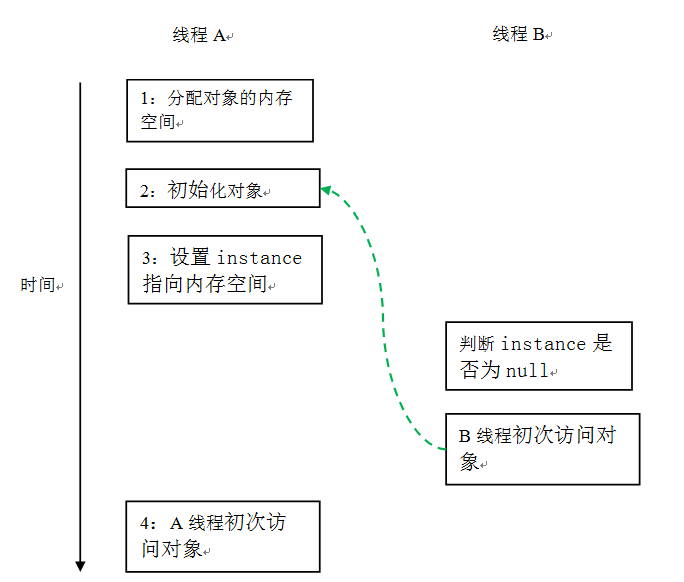

#线程安全
##线程安全的三个要素——原子性、可见性、有序性  
1. 原子性(Atomicity)  
由Java内存模型来直接保证的原子性变量操作包括read、load、use、assign、store和write六个，大致可以
认为基础数据类型的访问和读写是具备原子性的。如果应用场景需要一个更大范围的原子性保证，Java内存模
型还提供了lock和unlock操作来满足这种需求，尽管虚拟机未把lock与unlock操作直接开放给用户使用，但是
却提供了更高层次的字节码指令monitorenter和monitorexit来隐匿地使用这两个操作，这两个字节码指令反
映到Java代码中就是同步块---synchronized关键字，因此在synchronized块之间的操作也具备原子性。<br>
简单来说原子操作就是一个不可分割的操作，比如i=0（i非long或double类型），i++是一个非原子操作，可以
分为i = i + 1；非原子操作除了可以通过sychronized变成原子操作之外，还提供了更为灵活的API——Lock接
口来保证线程安全，另外在concurrent包下还提供了一些原子类，如：AtomicInteger、AtomicLong、
AtomicReference等。
2. 可见性(Visibility)  
可见性就是指当一个线程修改了线程共享变量的值，其它线程能够立即得知这个修改。Java内存模型是通过在
变量修改后将新值同步回主内存，在变量读取前从主内存刷新变量值这种依赖主内存作为传递媒介的方法来实
现可见性的，无论是普通变量还是volatile变量都是如此，普通变量与volatile变量的区别是volatile修饰的
变量不允许线程内部缓存和重排序，即直接修改内存。所以对其他线程是可见的。但是这里需要注意一个问题，
volatile只能让被他修饰内容具有可见性，但不能保证它具有原子性。比如 volatile int a = 0；之后有一个
操作 a++；这个变量a具有可见性，但是a++ 依然是一个非原子操作，也就这这个操作同样存在线程安全问题。
除了volatile之外，Java还有两个关键字能实现可见性，它们是synchronized。同步块的可见性是由“对一个
变量执行unlock操作之前，必须先把此变量同步回主内存中(执行store和write操作)”这条规则获得的，而
final关键字的可见性是指：被final修饰的字段是构造器一旦初始化完成，并且构造器没有把“this”引用传
递出去，那么在其它线程中就能看见final字段的值。
3. 有序性(Ordering)  
Java内存模型中的程序天然有序性可以总结为一句话：如果在本线程内观察，所有操作都是有序的；如果在一个
线程中观察另一个线程，所有操作都是无序的。前半句是指“线程内表现为串行语义”，后半句是指“指令重排
序”现象和“工作内存主主内存同步延迟”现象。Java语言提供了volatile和synchronized两个关键字来保证线
程之间操作的有序性，volatile关键字本身就包含了禁止指令重排序的语义，而synchronized则是由“一个变量
在同一时刻只允许一条线程对其进行lock操作”这条规则来获得的，这个规则决定了持有同一个锁的两个同步块
只能串行地进入。
<br>指令重排序的问题，编译器编译时会进行指令重排，代码执行顺序可能和编写顺序不一样：例如：
```text
int i = 0;
boolean flag = false; //语句3
i = 1;                //语句1  
flag = true;          //语句2`
```
语句1和语句2的执行顺序改变一下对程序的结果并没有什么影响，所以这时可能会改变这两条指令的顺
序。那么语句2会不会在语句3之前执行呢，答案是不会呢，因为语句2用到了语句3声明的变量，这时编
译器会限制语句的执行顺序来保证程序的正确性。
<br>在单线程中，改变指令的顺序可能不会产生不良后果，但是在多线程中就不一定了。例如：
```text
//线程1:
context = loadContext();   //语句1
inited = true;             //语句2

//线程2:
while(!inited ){
  sleep()
}
doSomethingwithconfig(context);
```
由于语句1和语句2没有数据依赖性，所以编译器可能会将两条指令重新排序，如果先执行语句2，这时线程
1被阻塞，然后线程2的while循环条件不满足，接着往下执行，但是由于context没有赋值，于是会产生错误。

##著名的双重锁校验
在java程序中，有时候可能需要推迟一些高开销的对象初始化操作，并且只有在使用这些对象时才进行初始化。
此时程序员可能会采用延迟初始化。但要正确实现线程安全的延迟初始化需要一些技巧，否则很容易出现问题。
比如，下面是非线程安全的延迟初始化对象的示例代码：
```java
public class UnsafeLazyInitialization {
    private static Instance instance;
    public static Instance getInstance() {
        if (instance == null) //1：A线程执行
            instance = new Instance(); //2：B线程执行
        return instance;
    }
}
```
在UnsafeLazyInitialization中，假设A线程执行代码1的同时，B线程执行代码2。此时，线程A可能会看到instance引用的对象还没有完成初始化（出现这种情况的原因见后文的“问题的根源”）。

对于UnsafeLazyInitialization，我们可以对getInstance()做同步处理来实现线程安全的延迟初始化。示例代码如下：
```java
public class UnsafeLazyInitialization {
    private static Instance instance;
    public synchronized static Instance getInstance() {
        if (instance == null) //1：A线程执行
            instance = new Instance(); //2：B线程执行
        return instance;
    }
}
```
由于对getInstance()做了同步处理，synchronized将导致性能开销。如果getInstance()被多个线程频繁的调用，
将会导致程序执行性能的下降。

在早期的JVM中，synchronized（甚至是无竞争的synchronized）存在这巨大的性能开销。因此，人们想出了一个
“聪明”的技巧：双重检查锁定（double-checked locking）。人们想通过双重检查锁定来降低同步的开销。下面
是使用双重检查锁定来实现延迟初始化的示例代码：
```java
public class DoubleCheckedLocking { 
    private static Instance instance;

    public static Instance getInstance() {
        if (instance == null) {
            synchronized (DoubleCheckedLocking.class) {
                if (instance == null)
                    instance = new Instance();           //问题的根源出在这里
            }
        }
        return instance;
    }
}
```
如上面代码所示，如果第一次检查instance不为null，那么就不需要执行下面的加锁和初始化操作。因此可以大幅降低
synchronized带来的性能开销。上面代码表面上看起来，似乎两全其美：
* 在多个线程试图在同一时间创建对象时，会通过加锁来保证只有一个线程能创建对象。
* 在对象创建好之后，执行getInstance()将不需要获取锁，直接返回已创建好的对象。
双重检查锁定看起来似乎很完美，但这是一个错误的优化！在线程执行到第4行代码读取到instance不为null时，
instance引用的对象有可能还没有完成初始化。

>现在的jvm中，没有争用的同步（一个线程拥有锁的时候，没有其他线程企图获得锁）的性能成本还是很低的;早期
JVM中的同步还没有优化，现在还是有很多人误解：不管是不是争用，同步都有很高的性能成本。

###问题的根源
回到第一节的有序性原则，问题就出在编译器进行指令重排序。`instance = new Singleton();`这一句代码可以分解为
下面三行伪代码
```text
memory = allocate();   //1：分配对象的内存空间
ctorInstance(memory);  //2：初始化对象
instance = memory;     //3：设置instance指向刚分配的内存地址
```
这三行代码可能会被重排序（在一些JIT编译器上，这种重排序是真实发生的，详情见参考文献1的“Out-of-order 
writes”部分）。2和3之间重排序之后的执行时序如下：
```text
memory = allocate();   //1：分配对象的内存空间
instance = memory;     //3：设置instance指向刚分配的内存地址
                       //注意，此时对象还没有被初始化！
ctorInstance(memory);  //2：初始化对象
```
>根据《The Java Language Specification, Java SE 7 Edition》（后文简称为java语言规范），所有线程在执行
java程序时必须要遵守intra-thread semantics。intra-thread semantics保证重排序不会改变单线程内的程序执
行结果。换句话来说，intra-thread semantics允许那些在单线程内，不会改变单线程程序执行结果的重排序。上
面三行伪代码的2和3之间虽然被重排序了，但这个重排序并不会违反intra-thread semantics。这个重排序在没有
改变单线程程序的执行结果的前提下，可以提高程序的执行性能。

为了更好的理解intra-thread semantics，请看下面的示意图

假设一个线程A在构造对象后，立即访问这个对象。单线程环境只要保证2排在4的前面，即使2和3之间重排序了，也
不会违反intra-thread semantics

多线程示意图如下

DoubleCheckedLocking示例代码的第7行（instance = new Singleton();）如果发生重排序，另一个并发执行的线程
B就有可能在第4行判断instance不为null。线程B接下来将访问instance所引用的对象，但此时这个对象可能还没有
被A线程初始化！下面是这个场景的具体执行时序：

时间|线程A|线程B
:---:|:---|:---
t1|A1：分配对象的内存空间|
t2|A3：设置instance指向内存空间
t3| |B1：判断instance是否为空
t4| |B2：由于instance不为null，线程B将访问instance引用的对象
t5|A2：初始化对象|
t6|A4：访问instance引用的对象|
java内存模型的intra-thread semantics将确保A2一定会排在A4前面执行。但A2和A3的重排序，将导致线程B在B1处
判断出instance不为空，线程B接下来将访问instance引用的对象。此时，线程B将会访问到一个还未初始化的对象。

基于volatile的双重检查锁定的解决方案
对于前面的基于双重检查锁定来实现延迟初始化的方案，只要对代码做一点点修改，就可以实现线程安全的延迟初始
化:把instance声明为volatile型
```java
public class SafeDoubleCheckedLocking {
    private volatile static Instance instance;

    public static Instance getInstance() {
        if (instance == null) {
            synchronized (SafeDoubleCheckedLocking.class) {
                if (instance == null)
                    instance = new Instance();//instance为volatile，现在没问题了
            }
        }
        return instance;
    }
}
```
当声明对象的引用为volatile后，“问题的根源”的三行伪代码中的2和3之间的重排序将会被禁止。代码执行顺序如下：


单例延迟加载的另一个方法参见[引用](http://www.infoq.com/cn/articles/double-checked-locking-with-delay-initialization)

##volatile关键字
volatile关键字关键字保证了可见性和一定程度上的有序性，但是不能保证原子性。
###volatile关键字关键字保证可见性
一旦一个共享变量（类的成员变量、类的静态成员变量）被volatile修饰之后，那么就具备了两层语义：
1. 保证了不同线程对这个变量进行操作时的可见性，即一个线程修改了某个变量的值，这新值对其他线程来说是立即可见的。
2. 禁止进行指令重排序。
###volatile关键字不能保证原子性
###volatile关键字在一定程度上保证有序性
[引用](http://blog.csdn.net/xingjiarong/article/details/47945849)